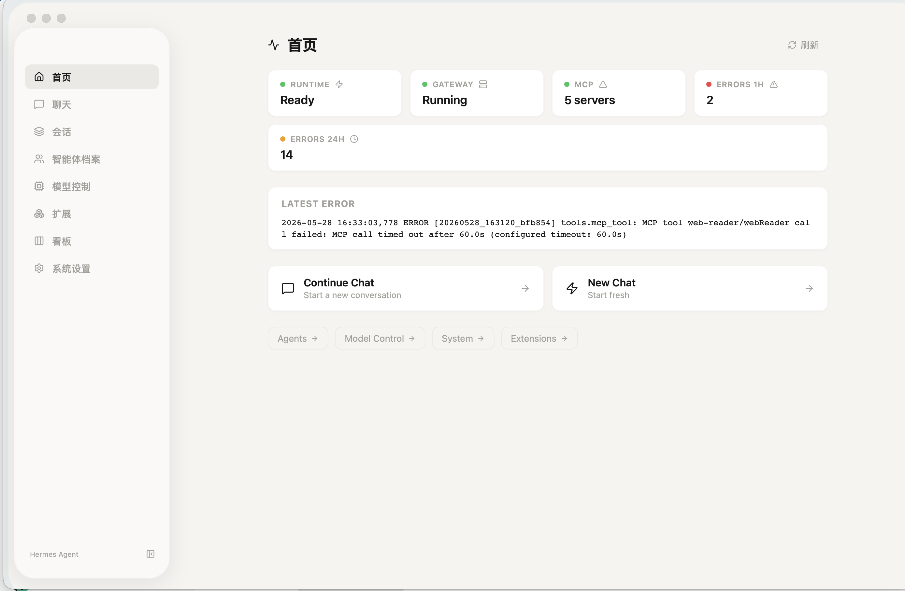
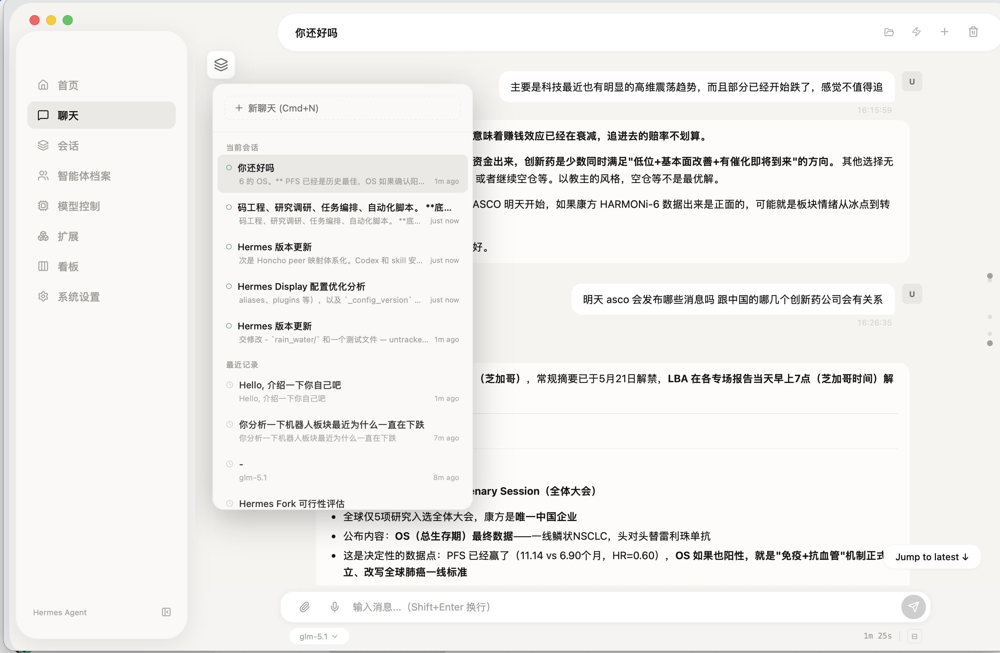
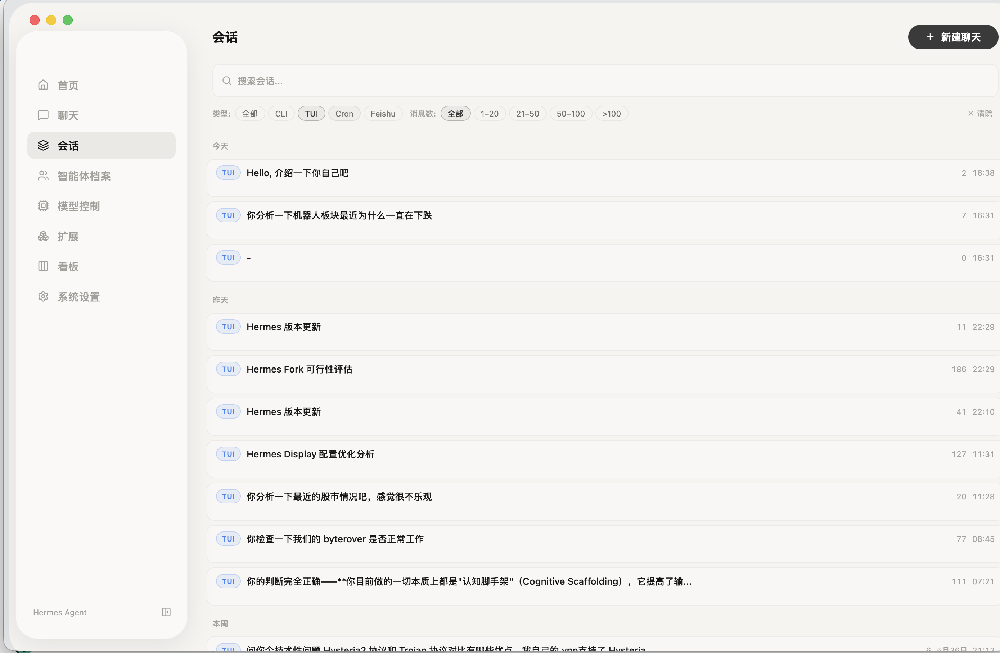
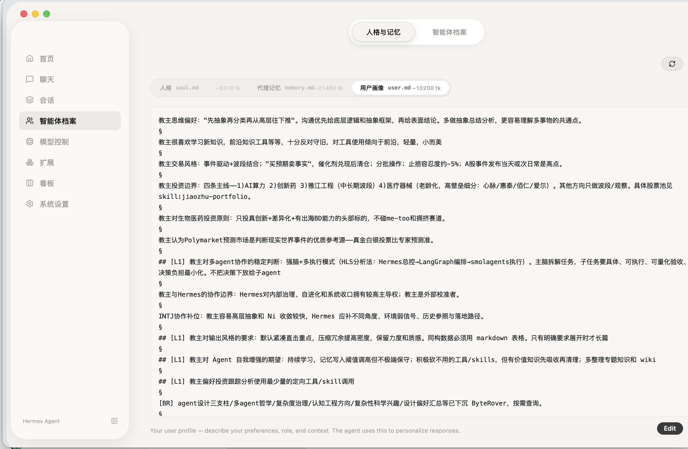
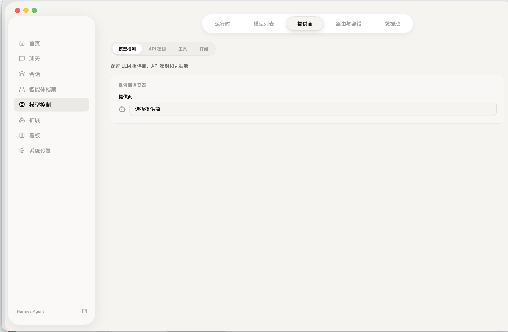
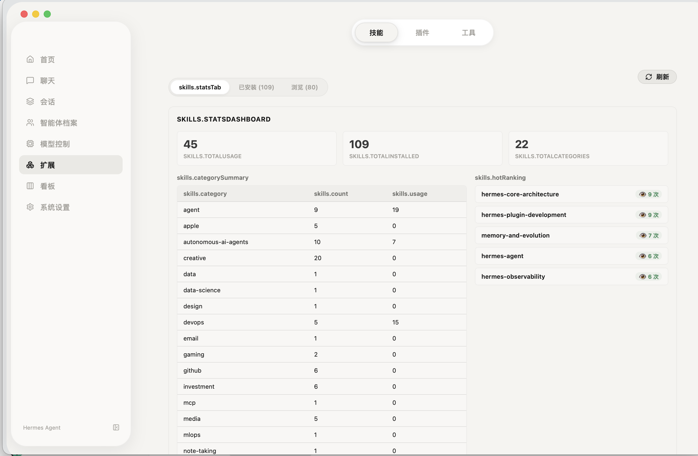
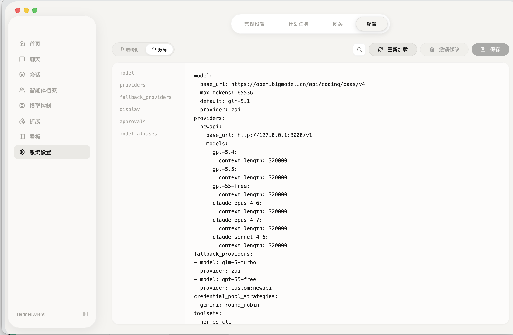
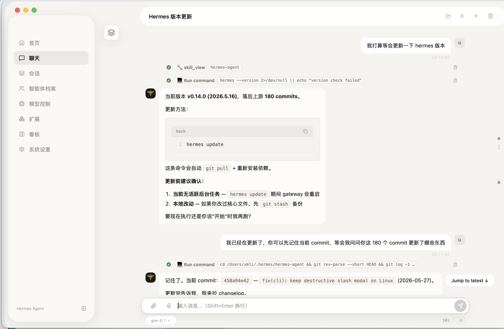

# Hermes Caduceus


<br/>
<p align="center">
  <a href="https://github.com/fathah/hermes-caduceus/blob/main/LICENSE"></a>
  <a href="https://github.com/fathah/hermes-caduceus/releases/"></a>
 
</p>

> **Fork 自 [hermes-desktop](https://github.com/NousResearch/hermes-desktop)** — 深度定制优化，专为 macOS 用户打造。从 Electron 重写为 Tauri 2 + React 19，聚焦原生性能、架构整洁和 macOS 专项优化。

## 语言

- 英文：`README.md`
- 简体中文：`README.zh-CN.md`

Hermes Caduceus 是一个原生 macOS 桌面客户端，用于安装、配置并与 [Hermes Agent](https://github.com/NousResearch/hermes-agent) 进行交互——一个具备工具使用、多平台消息和闭环学习能力的自我改进 AI 助手。

---

## 架构

```
┌─────────────────────────────────────────────────────┐
│                   React 19 前端                      │
│       (Chat、Sessions、Models、Gateway ...)           │
├─────────────────────────────────────────────────────┤
│                 Tauri IPC 桥接层                      │
│              156 个类型化 Rust 命令                    │
├────────────┬────────────┬────────────┬──────────────┤
│  配置管理   │   聊天命令  │   系统工具   │   语音输入    │
├────────────┴────────────┴────────────┴──────────────┤
│            TUI Gateway（stdin/stdout JSON-RPC）       │
│       自动重启 · 看门狗 · 健康诊断                      │
├─────────────────────────────────────────────────────┤
│            Python TUI Gateway（子进程）                │
│                Hermes Agent 核心                      │
└─────────────────────────────────────────────────────┘
```

应用将 Hermes Agent 作为受管的 Python 子进程运行，通过 stdin/stdout 上的 JSON-RPC 协议通信。Rust 后端将这些调用转化为类型化的 Tauri 命令供 React 前端使用——三层隔离架构，每层通过明确定义的协议通信。

### 关键架构决策

| 决策 | 原因 |
|------|------|
| **Tauri 2 替代 Electron** | 下载体积约 5 倍差距，原生 macOS 体验，不打包 Chromium |
| **JSON-RPC over stdio** | 无需 HTTP 端口、无 CORS、无网络暴露面——网关仅可被 Rust 进程访问 |
| **微任务流式渲染** | `Promise.resolve().then()` 替代 `requestAnimationFrame`，亚毫秒级文字刷新，消除 16ms rAF 瓶颈 |
| **能力基安全模型** | 最小 Tauri 权限（仅 `core:default` + 拖拽 + 缩放），CSP 头、URL scheme 校验，渲染进程无任意 shell 访问 |
| **直连 HTTP 模型探测** | `reqwest` 直接调用提供商 `/models` 端点——无需启动网关 |
| **档案隔离** | 每个档案拥有独立的 `~/.hermes/profiles/<name>/`，配置、环境和状态数据库完全隔离 |

### 为什么选 Tauri

|  | Tauri 2（本项目） | Electron（上游） |
|--|--|--|
| **下载体积** | ~11 MB `.dmg` | ~200 MB+ `.dmg` |
| **原生二进制** | ~5 MB | ~150 MB+（打包 Chromium + Node.js） |
| **渲染引擎** | 系统 WebKit（`WKWebView`） | 内置 Chromium |
| **内存占用** | ~60-80 MB RSS | ~300-500 MB RSS |
| **启动时间** | < 1 秒 | 3-5 秒 |
| **macOS 集成** | 原生：Metal、CoreML、CoreAudio、毛玻璃 | Chromium 兼容层 |
| **自动更新** | Rust 原生 Tauri updater | electron-updater |
| **安全面** | 6 个精选插件，能力门控 | 完整 Node.js + Chromium 访问 |

Tauri 在 macOS 上使用系统内置的 WebKit —— 不打包 Chromium。应用通过 macOS 系统更新获得 Apple 的安全补丁，而非依赖内置浏览器升级。Rust 后端编译为单一原生二进制（~10 MB），零运行时 GC 暂停。

#### 插件攻击面

仅加载 6 个 Tauri 插件——每个都有明确用途：

| 插件 | 用途 |
|------|------|
| `tauri-plugin-log` | 结构化日志 |
| `tauri-plugin-dialog` | 原生文件/文件夹选择对话框 |
| `tauri-plugin-shell` | 启动 Hermes 安装脚本 |
| `tauri-plugin-clipboard-manager` | 读写系统剪贴板 |
| `tauri-plugin-window-state` | 持久化窗口大小和位置 |
| `tauri-plugin-store` | 本地键值存储（偏好设置） |

#### CoreML 加速语音

`whisper-rs` 依赖编译时启用了 `coreml` 特性标志，将 whisper 推理路由到 Apple Silicon 的 CoreML 框架。相比纯 CPU whisper 推理，设备端语音转写速度显著提升。

---

## macOS 专项优化

### ProMotion 120Hz 渲染

启动时，Rust 后端设置两个 WebKit 环境变量以解锁完整 ProMotion 刷新率：

```rust
std::env::set_var("WebKitForceMetal", "1");
std::env::set_var("WebKitCanvasAcceleratedDrawingEnabled", "1");
```

强制 WebKit 使用 Apple Metal 进行硬件加速渲染，释放 MacBook Pro 屏幕的 120Hz 能力。配合微任务流式引擎，聊天文字以显示器原生刷新率逐字呈现——无掉帧、无缓冲。

### 原生窗口外观

- **Overlay 标题栏** + `hiddenTitle` —— 无缝工具栏集成，无双重标题栏
- **UnderPageBackground 毛玻璃** —— 半透明侧边栏，匹配 macOS 桌面色调
- **Metal GPU 合成** —— GPU 加速的 canvas 和 CSS 动画（通过 WKWebView）

### 本地语音输入

语音转文字完全在设备端运行，无云端依赖：

- **whisper-rs**（Whisper base 模型）本地语音识别
- **cpal + CoreAudio** —— 主线程捕获音频（macOS 要求），任意线程控制播放/暂停
- **VAD 静音检测** —— 3 秒静音后自动停止（能量阈值 0.0004）
- 一键录音 → 转写 → 粘贴到输入框

---

## 网关韧性

TUI Gateway 作为受监护子进程运行，具备自动恢复能力：

- **自动重启** —— 进程退出后最多 5 次重连（带退避）
- **看门狗** —— 65 秒超时检测 `Starting`/`Reconnecting` 僵死状态
- **健康诊断** —— `runtime_health` 返回状态、重启次数、挂起请求数、路径校验和最近 10 条失败记录
- **故障持久化** —— 最近 10 次网关失败写入 `~/.hermes/logs/gateway_failures.json`
- **60 秒启动超时** —— 为慢速网络下的 MCP 服务器发现提供充裕窗口

---

## 流式引擎

聊天流式管线设计为零文字丢失渲染，支持多 Tab 并发：

```
Gateway SSE → Tauri Event → useChatInbox → pendingChunks → 微任务 flush → flushedTextRef → React state
```

- **Per-tab 状态隔离** —— 每个 Tab 拥有独立的 `pendingChunks`、`flushedText`、`turnCompleted` ref
- **微任务调度** —— `Promise.resolve().then()` 在 JS 上下文清空后立即触发，而非等到下一帧
- **双 ref 一致性** —— `flushedTextRef` 同步跟踪已提交文本，避免 React 异步状态更新在 `message.complete` 期间的过期读取

---

## 极致 macOS 体验

Hermes Caduceus 不仅仅是一个跨平台应用的移植版，它是为 macOS 深度定制的原生级产品：

- **120Hz ProMotion 支持：** 通过强制启用 WebKit 的 Apple Metal API 加速，实现 120fps 的丝滑滚动和动画体验。
- **原生毛玻璃 (Vibrancy)：** 采用 `UnderWindowBackground` 实时背景采样效果，完美契合你的桌面壁纸，呈现经典的 macOS 玻璃质感。
- **Apple Silicon 深度优化：** 原生 ARM64 构建，并开启全代码链接优化 (LTO)，在 M1/M2/M3 芯片上性能表现卓越。
- **Safari 17 现代内核：** 充分利用最新版 WebKit 特性，显著降低内存占用并加速 JS 执行效率。
- **一体化标题栏：** 采用透明 Overlay 标题栏设计，与原生红绿灯按钮无缝集成，外观现代简洁。

## 安装指南

1. **下载** 最新 `.dmg`：[Releases](https://github.com/fathah/hermes-caduceus/releases/)
2. **安装** —— 打开 `.dmg`，将 `Hermes Caduceus` 拖入 `/Applications`
3. **首次启动** —— 右键 → **打开**（自签名应用需要），或执行：
   ```bash
   xattr -cr "/Applications/Hermes Caduceus.app"
   ```

## GitHub 自动化

- **自动构建：** 推送 `v*` 标签时自动构建 macOS (x64 + ARM64) `.dmg`
- **持续集成：** 每个 PR 自动运行 Lint、类型检查和单元测试

---

## 功能特性

- Hermes Agent 首次引导式安装，自动解决依赖
- 本地或远程后端 —— 本地 `127.0.0.1:8765`，或通过 SSH 隧道连接远程 Hermes API 服务器
- 多提供商支持 —— OpenRouter、Anthropic、OpenAI、Google (Gemini)、xAI (Grok)、Nous Portal、Qwen、MiniMax、Hugging Face、Groq 及本地 OpenAI 兼容端点（LM Studio、Ollama、vLLM、llama.cpp）
- 直连模型探测 —— 无需启动网关即可检测可用模型
- 流式聊天界面 —— SSE 流式 + 微任务刷新、工具进度指示、Markdown 渲染、语法高亮
- Token 用量追踪 —— 实时 prompt/completion token 计数和费用显示
- 34 个斜杠命令 —— `/new`、`/clear`、`/fast`、`/web`、`/image`、`/browse`、`/code`、`/file`、`/shell`、`/usage`、`/help`、`/tools`、`/skills`、`/model`、`/memory`、`/persona`、`/version`、`/compact`、`/compress`、`/undo`、`/retry`、`/debug`、`/status`、`/btw`、`/approve`、`/deny`、`/reset`、`/goal`、`/steer`、`/queue`、`/update`、`/kanban`、`/curator`、`/reload-skills`
- 会话管理 —— 全文搜索（SQLite FTS5）、按日期分组、分段会话支持跨段加载
- 档案切换 —— 独立的 Hermes 环境，隔离配置、环境和状态
- 32 个 API 密钥字段，覆盖 5 个工具类别 —— LLM、浏览器自动化、语音、研究等
- 记忆与人格 —— 查看/编辑记忆条目和 SOUL.md 人格
- 路由与 Fallback —— 默认模型、提供商和 fallback 链的 GUI 配置
- 定时任务 —— cron 任务构建器，支持 16 个投递目标
- 16 个消息网关 —— Telegram、Discord、Slack、WhatsApp、Signal、Matrix、iMessage、钉钉、飞书、企业微信、微信等
- 插件管理 —— 启用/禁用插件，支持按状态和来源过滤
- 语音输入 —— 本地语音识别 + VAD 自动停止
- 备份、导入与调试导出
- 国际化 —— 8 种语言（EN、ES、ID、JA、PT-BR、PT-PT、ZH-CN、ZH-TW）

## 预览

<table>
<tr>
<td width="50%" align="center"><b>首页</b><br/></td>
<td width="50%" align="center"><b>聊天</b><br/></td>
</tr>
<tr>
<td width="50%" align="center"><b>会话</b><br/></td>
<td width="50%" align="center"><b>记忆与人格</b><br/></td>
</tr>
<tr>
<td width="50%" align="center"><b>提供商</b><br/></td>
<td width="50%" align="center"><b>技能</b><br/></td>
</tr>
<tr>
<td width="50%" align="center"><b>配置</b><br/></td>
<td width="50%" align="center"><b>聊天详情</b><br/></td>
</tr>
</table>

---

## 开发

### 前置要求

- macOS 13+
- Node.js 22+ 和 Bun
- [Rust](https://rustup.rs/)

### 启动

```bash
bun install
bun run dev
```

### 检查与测试

```bash
bun run lint
bun run typecheck
bun run test
```

### 构建

```bash
bun run build:mac
```

## 技术栈

| 层 | 技术 |
|----|------|
| 原生 Shell | **Tauri 2**（Rust）— ~5,800 行 |
| 前端 | **React 19** + **TypeScript 5** — ~38,000 行 |
| 样式 | **Tailwind CSS** 4 |
| 构建 | **Vite** 7 |
| 国际化 | **i18next** |
| 测试 | **Vitest** + Rust tests |
| 语音 | **whisper-rs** + **cpal**（CoreAudio） |

## 致谢

- [Hermes Agent](https://github.com/NousResearch/hermes-agent) — 本应用管理的核心 AI Agent
- [hermes-desktop](https://github.com/NousResearch/hermes-desktop) — 本项目 fork 的上游 Electron 项目
