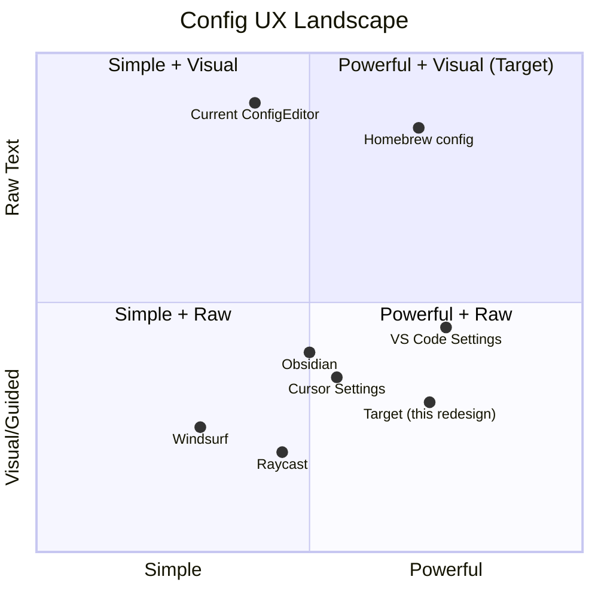

# PRD: Config Screen Redesign

**Author**: Alice (Product Manager)
**Date**: 2025-07-15
**Project**: hermes-caduceus
**Language**: TypeScript (Vite + React + MUI + Tailwind CSS)
**Status**: Draft

---

## 1. Project Information

- **Original Request**: Redesign the Config screen from a monolithic YAML editor to a tabbed visual configuration interface
- **Project Name**: `config_screen_redesign`
- **Programming Language**: TypeScript, React, Vite, MUI, Tailwind CSS

---

## 2. Product Definition

### 2.1 Product Goals

1. **Lower the barrier to configuration**: Replace raw YAML editing for ~80% of settings with intuitive form controls (toggles, dropdowns, sliders), while retaining raw YAML access for power users
2. **Precision updates**: Every individual field change should trigger a targeted `set_config("dotted.key", value)` call, eliminating the risk of full-file overwrite corruption and improving the hermes file protection story
3. **Clear separation of concerns**: Model/providers/aliases management lives in the dedicated Models page; the Config screen focuses on everything else — agent behavior, display, performance, integrations, and advanced tuning

### 2.2 User Stories

| # | Story |
|---|-------|
| US-1 | As a **new user**, I want to configure common settings (theme, language, agent personality) through dropdowns and toggles, so that I don't need to learn YAML syntax |
| US-2 | As a **power user**, I want a raw YAML tab to make bulk edits or access settings not yet exposed in the visual UI, so that I retain full control |
| US-3 | As a **team admin**, I want to disable specific toolsets (e.g., discord, browser) without touching YAML, so that I can enforce policy safely |
| US-4 | As a **developer**, I want to tune compression, caching, and checkpoint parameters through number inputs with validation hints, so that I can optimize performance without reading source code |
| US-5 | As a **returning user**, I want unsaved changes to persist visually (dirty state indicator per tab), so that I know what's changed before I leave the page |

---

## 3. Tab/Section Breakdown with Field Specifications

### Tab Overview

| # | Tab Label | YAML Section(s) | Purpose |
|---|-----------|-----------------|---------|
| T1 | **Agent** | `agent` | Core agent behavior, reasoning, toolsets, personality |
| T2 | **Display** | `display`, `dashboard` | UI theme, layout preferences, streaming, language |
| T3 | **Web & Terminal** | `terminal`, `web`, `browser` | Terminal cwd, web search backend, browser timeout |
| T4 | **Performance** | `compression`, `prompt_caching`, `checkpoints`, `delegation` | Compression, caching, checkpoints, sub-agent delegation |
| T5 | **Auxiliary** | `auxiliary`, `tts`, `stt`, `context`, `memory` | Vision/Web extract providers, TTS/STT, memory, context engine |
| T6 | **Advanced** | `approvals`, `command_allowlist`, `skills`, `credential_pool_strategies`, `timezone` | Approvals, allowlists, skills config, credential strategies |
| T7 | **Raw YAML** | (entire file) | Full-file YAML editor with search, outline, diff preview |

### 3.1 Tab T1: Agent

| Field Key | Label | Control Type | Default | Description |
|-----------|-------|-------------|---------|-------------|
| `agent.max_turns` | Max Turns | NumberInput (min: 1, max: 1000) | 200 | Maximum conversation turns per session |
| `agent.gateway_timeout` | Gateway Timeout (s) | NumberInput (min: 60, max: 7200) | 2800 | Gateway request timeout in seconds |
| `agent.restart_drain_timeout` | Restart Drain Timeout | NumberInput (min: 0, max: 300) | 60 | Grace period for draining on restart |
| `agent.gateway_notify_interval` | Notify Interval | NumberInput (min: 30, max: 3600) | 600 | Interval between gateway notifications |
| `agent.reasoning_effort` | Reasoning Effort | Select (low / medium / high) | high | Model reasoning effort level |
| `agent.personalities.hermes` | Hermes Personality | Textarea (3-5 rows) | "..." | System personality description text |
| `agent.disabled_toolsets` | Disabled Toolsets | MultiSelect (dynamic options) | [discord, kanban] | Toolsets to disable; options populated from available toolsets |

**Layout**: Vertical stack, 2-column grid for number inputs, full-width for textarea, toolset list at bottom.

### 3.2 Tab T2: Display

| Field Key | Label | Control Type | Default | Description |
|-----------|-------|-------------|---------|-------------|
| `display.compact` | Compact Mode | Toggle | true | Enable compact UI layout |
| `display.personality` | Display Personality | Select (from personalities) | hermes | Which personality to use for UI display |
| `display.resume_display` | Resume Display | Select (minimal / full) | minimal | How to display session resumes |
| `display.tui_auto_resume_recent` | Auto Resume Recent | Toggle | true | Automatically resume most recent session |
| `display.bell_on_complete` | Bell on Complete | Toggle | true | Sound notification on task completion |
| `display.show_reasoning` | Show Reasoning | Toggle | true | Show agent reasoning in UI |
| `display.streaming` | Streaming | Toggle | true | Stream responses in real-time |
| `display.timestamps` | Timestamps | Toggle | true | Show message timestamps |
| `display.show_cost` | Show Cost | Toggle | true | Display token/cost information |
| `display.language` | Language | Select (en / zh / ja / es / pt-BR / pt-PT / id) | zh | UI display language |
| `display.runtime_footer.enabled` | Runtime Footer | Toggle | true | Show runtime footer bar |
| `display.background_process_notifications` | BG Process Notifications | Select (all / errors / none) | all | Notification level for background processes |
| `display.details_mode` | Details Mode | Select (collapsed / expanded) | collapsed | Default state for detail panels |
| `display.mouse_tracking` | Mouse Tracking | Toggle | true | Enable mouse position tracking |
| `display.sections.activity` | Activity Section | Select (collapsed / expanded) | collapsed | Activity panel default state |
| `display.sections.thinking` | Thinking Section | Select (collapsed / expanded) | collapsed | Thinking panel default state |
| `display.sections.tools` | Tools Section | Select (collapsed / expanded) | collapsed | Tools panel default state |
| `display.statusbar` | Status Bar | Toggle | true | Show status bar |
| `display.tool_progress` | Tool Progress | Select (all / errors / none) | all | Tool progress visibility |
| `dashboard.theme` | Dashboard Theme | Select (from available themes) | apple | Dashboard color theme |

**Layout**: 3-column grid for toggles, 2-column for dropdowns. "Sections" grouped in a sub-section card. Theme with color preview swatch.

### 3.3 Tab T3: Web & Terminal

| Field Key | Label | Control Type | Default | Description |
|-----------|-------|-------------|---------|-------------|
| `terminal.cwd` | Working Directory | TextInput | /Users/xmli/.hermes/datas | Default terminal working directory |
| `terminal.timeout` | Terminal Timeout (s) | NumberInput (min: 30, max: 3600) | 600 | Terminal command timeout |
| `web.backend` | Web Search Backend | Select (tavily / brave / google / duckduckgo) | tavily | Default web search backend |
| `web.extract_backend` | Extract Backend | Select (firecrawl / jina / tavily) | firecrawl | Web content extraction backend |
| `browser.command_timeout` | Browser Timeout (s) | NumberInput (min: 30, max: 600) | 120 | Browser command timeout |

**Layout**: 2-column layout with grouped sections for Terminal, Web, Browser.

### 3.4 Tab T4: Performance

| Field Key | Label | Control Type | Default | Description |
|-----------|-------|-------------|---------|-------------|
| `compression.threshold` | Compression Threshold | NumberInput (0-1, step 0.05) | 0.6 | Message compression trigger ratio |
| `compression.protect_last_n` | Protect Last N | NumberInput (min: 1, max: 100) | 9 | Messages protected from compression (tail) |
| `compression.protect_first_n` | Protect First N | NumberInput (min: 0, max: 50) | 2 | Messages protected from compression (head) |
| `prompt_caching.cache_ttl` | Cache TTL | TextInput (duration) | 1h | Prompt cache time-to-live |
| `prompt_caching.long_lived_prefix` | Long-lived Prefix | Toggle | true | Enable long-lived prefix caching |
| `prompt_caching.long_lived_ttl` | Long-lived TTL | TextInput (duration) | 1h | Long-lived cache TTL |
| `checkpoints.enabled` | Checkpoints Enabled | Toggle | true | Enable session checkpoints |
| `checkpoints.max_snapshots` | Max Snapshots | NumberInput (min: 1, max: 100) | 8 | Maximum checkpoint snapshots |
| `checkpoints.retention_days` | Retention Days | NumberInput (min: 1, max: 90) | 5 | Days to retain checkpoints |
| `delegation.model` | Delegation Model | TextInput | gemini-3.5-flash | Model for sub-agent delegation |
| `delegation.provider` | Delegation Provider | TextInput | custom | Provider for sub-agent delegation |
| `delegation.max_concurrent_children` | Max Concurrent Children | NumberInput (min: 1, max: 20) | 5 | Max concurrent sub-agents |
| `delegation.default_toolsets` | Default Toolsets | MultiSelect (tool names) | [terminal, file, web] | Default toolsets for delegated agents |

**Layout**: 3 section cards (Compression, Caching, Checkpoints, Delegation), each with 2-column grid. Duration inputs with helper text showing accepted format (e.g., "1h", "30m", "1d").

### 3.5 Tab T5: Auxiliary

| Field Key | Label | Control Type | Default | Description |
|-----------|-------|-------------|---------|-------------|
| `auxiliary.vision.provider` | Vision Provider | TextInput | gemini | Provider for vision API |
| `auxiliary.vision.model` | Vision Model | TextInput | gemini-3-flash-preview | Model for vision API |
| `auxiliary.web_extract.provider` | Web Extract Provider | TextInput | gemini | Provider for web extraction |
| `auxiliary.web_extract.model` | Web Extract Model | TextInput | gemini-3.1-flash-lite-preview | Model for web extraction |
| `auxiliary.compression.provider` | Compression Provider | TextInput | gemini | Provider for compression |
| `auxiliary.compression.model` | Compression Model | TextInput | gemini-3.1-flash-lite-preview | Model for compression |
| `auxiliary.compression.timeout` | Compression Timeout | NumberInput | 240 | Compression request timeout |
| `auxiliary.compression.context_length` | Context Length | NumberInput | 1000000 | Compression context window |
| `tts.provider` | TTS Provider | TextInput | custom | Text-to-speech provider |
| `tts.edge.voice` | TTS Voice | TextInput | zh-CN-XiaoxiaoNeural | Edge TTS voice name |
| `stt.provider` | STT Provider | TextInput | custom | Speech-to-text provider |
| `stt.local.model` | STT Model | Select (tiny / small / medium / large) | medium | Local STT model size |
| `context.engine` | Context Engine | TextInput | hce | Context management engine |
| `memory.memory_char_limit` | Memory Char Limit | NumberInput | 10000 | Memory character limit |
| `memory.user_char_limit` | User Char Limit | NumberInput | 3900 | User info character limit |
| `memory.provider` | Memory Provider | TextInput | hermes-tide-memory | Memory backend provider |
| `memory.flush_min_turns` | Flush Min Turns | NumberInput (min: 1) | 8 | Minimum turns before memory flush |
| `memory.nudge_interval` | Nudge Interval | NumberInput | 12 | Memory nudge interval |

**Layout**: 4 section cards (Vision, Web Extract, Compression, TTS/STT, Memory). Each with 2-column grid.

### 3.6 Tab T6: Advanced

| Field Key | Label | Control Type | Default | Description |
|-----------|-------|-------------|---------|-------------|
| `approvals.mode` | Approval Mode | Select (smart / always / never) | smart | Command approval mode |
| `approvals.timeout` | Approval Timeout (s) | NumberInput (min: 30, max: 600) | 120 | Approval request timeout |
| `command_allowlist` | Command Allowlist | TagInput (string array) | ["..."] | Allowed commands list |
| `skills.config` | Skills Config | JSON/YAML Editor (small) | {...} | Skills configuration object |
| `skills.disabled` | Disabled Skills | MultiSelect (dynamic) | [...] | Disabled skills list |
| `credential_pool_strategies.gemini` | Gemini Cred Strategy | Select (round_robin / random / first) | round_robin | Credential selection strategy |
| `timezone` | Timezone | Autocomplete (IANA tz names) | Asia/Shanghai | System timezone |

**Layout**: Section cards with appropriate controls. Skills disabled list as scrollable multi-select. Timezone with autocomplete. Command allowlist as tag chips with add/remove.

### 3.7 Tab T7: Raw YAML

This tab retains the **existing ConfigEditor component** with all its current functionality:
- Full YAML textarea with syntax awareness
- Search (Ctrl+F) with match count and navigation
- Outline sidebar showing top-level keys
- Diff preview on save
- Schema hints for common typos
- Uses `write_config_yaml` for full-file replacement (the only place where full-file writes happen)

**Key difference from current**: The Raw tab should show a warning banner: "Changes made here overwrite the entire file. For individual setting changes, use the visual tabs."

---

## 4. YAML → Visual Control Mapping

### Control Type Reference

| Control | Use Case | Example |
|---------|----------|---------|
| **Toggle** | Boolean values (true/false) | `display.compact: true` |
| **Select** | Enumerated string values with ≤ 10 options | `display.language: zh` |
| **NumberInput** | Integer or float values with min/max | `agent.max_turns: 200` |
| **TextInput** | Free-form string values | `terminal.cwd` |
| **Textarea** | Long text blocks | `agent.personalities.hermes` |
| **MultiSelect** | List of strings from a known pool | `agent.disabled_toolsets` |
| **TagInput** | List of strings with add/remove (free-form) | `command_allowlist` |
| **DurationInput** | Time duration strings (1h, 30m) | `prompt_caching.cache_ttl: 1h` |
| **Autocomplete** | String from very large pool | `timezone` |
| **JSONEditor** | Complex nested objects | `skills.config` |

### Value Encoding Rules for `set_config(key, value)`

| Value Type | Encoding |
|------------|----------|
| Boolean | `"true"` / `"false"` |
| Number | String representation, e.g., `"200"`, `"0.6"` |
| String | Passed directly |
| Array | JSON-encoded string, e.g., `'["discord","kanban"]'` |
| Object | JSON-encoded string, e.g., `'{"key":"val"}'` |

---

## 5. Update Strategy

### 5.1 Primary: Key-Level Updates via `set_config`

Every visual control change fires an **immediate** debounced (300ms) call:

```
setConfig("dotted.key", encodedValue, profile?)
```

This calls the Rust backend `set_yaml_value()`, which:
1. Reads the current config.yaml
2. Finds the exact YAML path for the dotted key
3. Replaces only that value in-place
4. Writes the file back

**Benefits**:
- Hermes file protection boundaries respected (non-hermes files untouched)
- Concurrent edits to different keys safe (last-write-wins per key)
- Failure scoped to a single key change

### 5.2 Secondary: Full-File Replacement

Only the Raw YAML tab uses `write_config_yaml()`. This path:
1. Validates YAML syntax before write
2. Shows a diff confirmation dialog
3. On confirm, performs full file replacement

### 5.3 Debounce & Optimistic UI

| Scenario | Behavior |
|----------|----------|
| Toggle/Single select change | Update UI immediately (optimistic), queue `set_config` with 300ms debounce |
| TextInput change | Update UI immediately, queue `set_config` with 500ms debounce |
| Textarea/MultiSelect | Update UI immediately, queue `set_config` with 1000ms debounce |
| Tab switch during pending | Flush pending updates for departing tab immediately |
| `set_config` failure | Revert the optimistically-updated field, show inline error toast |

### 5.4 Data Loading

On mount, load full config.yaml via `readConfigYaml()` once, then parse into a typed config object client-side. Each tab reads from this shared state. After any `set_config` call succeeds, update the relevant slice of the client-side state. The Raw YAML tab re-reads from disk when it becomes active (to pick up changes from other tabs).

---

## 6. UI Layout Mockup

```
┌──────────────────────────────────────────────────────────────┐
│  Config                                                        │
│  ┌──────────────────────────────────────────────────────────┐ │
│  │ [Agent] [Display] [Web] [Performance] [Auxiliary] [Adv] [Raw] │
│  └──────────────────────────────────────────────────────────┘ │
│                                                                │
│  ┌──── Tab: Agent ──────────────────────────────────────────┐ │
│  │                                                            │ │
│  │  ┌─── Reasoning ───────────────────────────────────────┐  │ │
│  │  │ Max Turns:    [ 200        ]  (1-1000)               │  │ │
│  │  │ Gateway TO:   [ 2800       ]  seconds                │  │ │
│  │  │ Reasoning:    [ high ▼    ]                          │  │ │
│  │  └─────────────────────────────────────────────────────┘  │ │
│  │                                                            │ │
│  │  ┌─── Personality ─────────────────────────────────────┐  │ │
│  │  │ Hermes:  ┌──────────────────────────────────────┐    │  │ │
│  │  │          │ You are Hermes, a helpful AI...       │    │  │ │
│  │  │          │                                      │    │  │ │
│  │  │          └──────────────────────────────────────┘    │  │ │
│  │  └─────────────────────────────────────────────────────┘  │ │
│  │                                                            │ │
│  │  ┌─── Disabled Toolsets ───────────────────────────────┐  │ │
│  │  │ [✓] terminal   [✓] file   [✗] discord   [✗] kanban   │  │ │
│  │  │ [✓] web        [✓] browser [✓] vision    [✓] tts     │  │ │
│  │  └─────────────────────────────────────────────────────┘  │ │
│  │                                                            │ │
│  └────────────────────────────────────────────────────────────┘ │
│                                                                │
│  ⚡ All changes auto-saved                                    │
└──────────────────────────────────────────────────────────────┘
```

**Key UX Elements**:
- Tab bar at top with 7 tabs, active tab highlighted
- Section cards with clear headers and grouped fields
- Help tooltips (?) next to non-obvious field labels
- Inline validation hints (e.g., "Must be between 1 and 1000")
- No "Save" button on visual tabs (auto-save); persistent "All changes saved" indicator
- Raw YAML tab retains Save/Discard buttons

---

## 7. Edge Cases & Risk Mitigation

### 7.1 Hermes File Protection

**Risk**: `set_config` writes directly to config.yaml. If the file is managed by hermes protection, direct writes could conflict.

**Mitigation**:
- `set_yaml_value` uses in-place text replacement, preserving comments and formatting (no YAML serialize/deserialize round-trip)
- The Rust function operates on byte offsets, so non-targeted content is preserved exactly
- Should verify with the hermes protection system that key-level YAML updates are safe

### 7.2 Concurrent Edits

**Risk**: User edits in Raw YAML tab while visual tabs have pending changes.

**Mitigation**:
- When switching to Raw YAML tab, flush all pending `set_config` calls
- Re-read config.yaml from disk when Raw tab activates
- When switching from Raw to visual, if Raw tab has unsaved changes, show "You have unsaved changes in Raw YAML. Switch and discard, or go back and save?" dialog
- Visual tabs show dirty state per tab based on comparison with last-saved state

### 7.3 YAML Validation

**Risk**: Raw YAML tab can introduce invalid YAML.

**Mitigation**:
- Raw tab retains existing YAML validation (real-time `js-yaml` parse check)
- Visual tabs only write via `set_config`, which is safe by construction
- If config.yaml becomes unparseable (detected on load), show a recovery banner: "Config file has YAML errors. Fix in Raw YAML tab or reset to defaults."

### 7.4 Setting Removal

**Risk**: What if user wants to delete a setting to use the default?

**Mitigation**:
- For toggle/select fields: always have a value. To "unset", provide explicit "Default" option
- For optional fields (e.g., `stt.local.model`): add a "Use Default" toggle that, when enabled, calls a `delete_config_key` or sends empty value
- P1: Implement `delete_config_key` backend command that removes a YAML key in-place

### 7.5 Unknown/Migrated Settings

**Risk**: Visual tabs only cover the specified YAML keys. What about keys not mapped to visual controls?

**Mitigation**:
- Raw YAML tab is always available as escape hatch
- On load, detect unrecognized top-level keys and show a banner: "X settings are only configurable in the Raw YAML tab" with count
- Future: dynamically generate controls from YAML schema

### 7.6 API Key / Secret Fields

**Risk**: Some config values may contain secrets (e.g., provider API keys).

**Mitigation**:
- Identify sensitive keys; render them as password fields (masked) with a reveal toggle
- Currently, model config (with API keys) is managed in Models page — not in this redesign scope
- For any sensitive fields discovered later, apply masked input by default

### 7.7 Empty/Missing config.yaml

**Risk**: Fresh install has no config.yaml.

**Mitigation**:
- `set_config` backend already handles missing file (creates it)
- Frontend: on load with empty content, show all tabs with default values, with a subtle "Using defaults" indicator
- On first `set_config` call, the file is auto-created

---

## 8. Competitive Analysis

### 8.1 Comparable Products

| Product | Config Approach | Strengths | Weaknesses |
|---------|----------------|-----------|------------|
| **VS Code Settings** | JSON editor + visual UI | Seamless sync between UI and JSON; excellent search | Settings sprawl; hard to find rare settings |
| **Cursor Settings** | Tabbed UI + JSON toggle | Clean tab organization; immediate sync | JSON editor feels secondary |
| **Windsurf Settings** | Form-based with JSON | Simple for common settings | Limited depth; no raw access for power users |
| **Obsidian Settings** | Tabbed with plugin extensibility | Community plugin config integration; search | Core/plugin distinction confusing |
| **1Password Settings** | Sectioned forms | Polished UX; clear groupings | No raw edit capability; rigid |
| **Homebrew config** | Pure file-based (Ruby/YAML) | Ultimate flexibility; version controllable | High barrier; typos are silently ignored |
| **Raycast Preferences** | Searchable command palette + forms | Fastest path to any setting via search | No raw file access |

### 8.2 Competitive Quadrant Chart



**Target Position**: Top-right quadrant — combining the power of raw YAML access with intuitive visual controls. We land between VS Code (very powerful but complex) and Cursor (cleaner but less deep).

---

## 9. Priority Matrix

### P0 — Must Have (MVP)

| # | Feature | Rationale |
|---|---------|-----------|
| P0-1 | Tab bar with 7 tabs (Agent, Display, Web, Performance, Auxiliary, Advanced, Raw) | Core navigation |
| P0-2 | Visual form controls for Agent tab (toggles, number inputs, selects) | Primary use case |
| P0-3 | Visual form controls for Display tab | Most-touched settings |
| P0-4 | `set_config` integration for every visual control change | Core update strategy |
| P0-5 | Raw YAML tab retaining current editor features | Power user escape hatch |
| P0-6 | Field change → immediate `set_config` with debounce | Core UX |
| P0-7 | Shared config state across tabs | Consistency |

### P1 — Should Have

| # | Feature | Rationale |
|---|---------|-----------|
| P1-1 | Per-tab dirty indicator (dot on tab, field highlight) | UX clarity |
| P1-2 | Inline field validation with error messages | Prevent bad config |
| P1-3 | "Manage in Models page" link replacing model YAML in Raw tab | Clear ownership |
| P1-4 | Toggle control for boolean fields | Visual polish |
| P1-5 | Section card grouping with collapsible headers | Organization |
| P1-6 | Help tooltips on non-obvious settings | Onboarding |
| P1-7 | Auto-save indicator ("All changes saved" / "Saving...") | Feedback |

### P2 — Nice to Have

| # | Feature | Rationale |
|---|---------|-----------|
| P2-1 | Setting search across all tabs (spotlight-style) | Discoverability |
| P2-2 | Config export/import (JSON dump) | Backup |
| P2-3 | Config diff view showing changes since last profile switch | Audit |
| P2-4 | Reset-to-default per field (right-click context menu) | Convenience |
| P2-5 | `delete_config_key` backend command for key removal | Completeness |
| P2-6 | MultiSelect with search filter for long lists (toolsets, skills) | Usability |
| P2-7 | Duration picker component (natural language → e.g., "1h30m") | UX polish |

---

## 10. Technical Requirements Summary

| Requirement | Detail |
|-------------|--------|
| **Frontend** | React + TypeScript, MUI components, Tailwind CSS utilities |
| **API Calls** | `setConfig(key, value)`, `readConfigYaml()`, `writeConfigYaml()` |
| **State Management** | React Context or Zustand store for shared config state |
| **Debounce** | 300ms (immediate), 500ms (text), 1000ms (textarea/multi) |
| **Error Handling** | Try/catch per `set_config` call, inline field error display |
| **File Write** | Only `set_config` on visual tabs; `write_config_yaml` on Raw tab |
| **Backend** | Existing Rust `set_yaml_value()` — no changes needed |
| **i18n** | All labels, hints, errors through existing i18n system |

---

## 11. Open Questions

1. **Can `disabled_toolsets` be expressed as a simple list vs the nested `platform_toolsets.cli` structure?** The current backend has `set_toolsets_enabled` which manages the nested YAML. We may need a dedicated `set_toolset_enabled(name, enabled)` command instead of generic `set_config`.

2. **How should `skills.config` (a complex nested object) be edited?** A full YAML sub-editor, or a JSON editor plugin? Or a structured sub-form?

3. **Should `command_allowlist` be editable as tag chips or a raw text area?** Tag chips are better UX but harder to implement for free-form strings.

4. **What happens to `model`, `providers`, `model_aliases`, `fallback_providers` in the Raw YAML tab?** Should they be read-only with a link to Models page, or remain editable?

5. **Profile switching**: When the user switches profiles, should pending config changes be auto-saved to the current profile first?

6. **Duration format**: Is the duration format strictly Go duration syntax (`1h30m`), or a custom format? Need backend compatibility confirmation.

---

## 12. Success Metrics

| Metric | Target |
|--------|--------|
| Config-related support tickets | ↓ 60% within 3 months |
| Time to change a common setting (theme, language) | < 5 seconds (vs ~30s in raw YAML) |
| Accidental config corruption incidents | 0 (key-level updates eliminate full-file risk) |
| Raw YAML tab usage | < 20% of config sessions (indicates visual tabs are sufficient) |
| User satisfaction (in-app feedback) | ≥ 4.2 / 5 |
